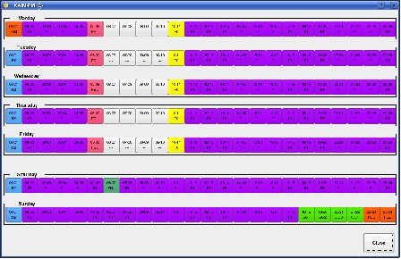

!SLIDE center
# Rivendell
## Ateliers

!SLIDE bullets center
# Environnement

## Topologie

!SLIDE bullets center
# Environnement

## Vue d'ensemble

!SLIDE bullets incremental
# Environnement
## Travailler avec   un logiciel libre

* Sources, documentations, idées, ...
* Rivendell = 10 ans de travail
* Collectif
* Remonter l'information
* rivendell-fr@lists.tryphon.org

!SLIDE bullets incremental
# Environnement #
## Linux

* Distribution: Ubuntu, Debian, SUSE
* Environnement graphique: Gnome, KDE
* Clavier, Souris :)

!SLIDE bullets
# Environnement #
## "Lancer" Rivendell

* Studios : rien à faire
* Administration : les menus ;)

!SLIDE center
# RdAirPlay

!SLIDE bullets
# RdAirPlay
## Des Carts et du son

* Direct
* Jingles, Musiques, Emissions, Reportages, ...
* Plusieurs pistes sur la table

!SLIDE bullets workshop imgside
# RdAirPlay

## MainLog

* Ajouter un jingle et une musique
* Lancer
* Mode Manuel, Automatique, Live Assist
* Lancer avec annonce micro

!SLIDE bullets workshop imgside
# RdAirPlay

## SoundPanel

* Definir 2/3 jingles
* Départ / Arrêt
* Enchainement avec MainLog
* User / System

!SLIDE bullets workshop imgside
# RdAirPlay

## Logs

* Vider le MainLog
* Charger un Log
* Pré-écoute
* Ajouter / Déplacer

!SLIDE bullets workshop imgside
# RdAirPlay

## Automatique

* Lancer un Log en Automatique
* Changer la transition
* Fixer une heure de départ
* Charger Aux1

!SLIDE bullets center
# RdAirPlay

## A l'heure

* Horloge
* Lancement Planifié
* Restant, Talk
* Prochain Arrêt

!SLIDE bullets workshop
# RdAirPlay

## A l'heure

* Lancer un Cart avec Talk
* Passer Next Stop à rouge
* Passer Next Stop à orange

!SLIDE bullets imgside
# RdLibrary

## Cart & Cut

* Import / Stockage
* Plus de fichier/format
* Son(s)
* Metadonnées

!SLIDE bullets
# RdLibrary
## Importer

* Manuel / DropBoxes / NAS
* Normalisation / Trim / 44.1kHz/48kHz
* Metadonnées (id3v2, chunks, ...)

!SLIDE bullets workshop
# RdLibrary

## Importer

* Importer un CD
* Un reportage
* Un album en MP3
* Une série d'émission

!SLIDE bullets imgside
# RdLibrary
## Son / Cut

* Courbe
* Pré-écoute
* Marqueurs

!SLIDE bullets workshop
# RdLibrary
## Son / Cut

* Ecouter
* Tester le fonctionnement d'un des marqueurs
* Exporter un Son

!SLIDE bullets imgside
# RdLibrary

## Ranger / Renseigner

* Jingle, générique, musiques
* Reportages, Emissions, Rediffusions
* Liste des Groupes

!SLIDE bullets workshop
# RdLibrary
## Ranger / Renseigner

* Créer un Cart manuellement
* Renseigner une musique
* Renseigner une émission

!SLIDE bullets workshop
# RdLibrary
## Magic Carts

* Créer un Cart   avec plusieurs jingles
* Lancer dans SoundPanel
* Créer un Cart   avec les épisodes d'une émission
* Lancer

!SLIDE bullets center
# RdLogEdit

!SLIDE bullets workshop
# RdLogEdit
## Log d'une émission

* Générique
* 2/3 Musiques
* Jingles
* Reportages

chargé dans RdAirPlay

!SLIDE bullets workshop
# RdLogEdit
## Template

* Log de base
* Save As
* Delete On
* Auto Refresh

!SLIDE bullets workshop
# RdLogEdit
## Log et Heure

* Jingle Horaire
* Emission
* Musiques
* Jingle au 1/4h suivant

!SLIDE bullets workshop
# RdLogEdit
## Transition STOP

* Jingle Horaire
* Silence pendant 10m
* Jingle
* Musique

!SLIDE bullets
# RdAdmin

## Gérer

* Groups
* Hosts
* Reports
* ...

!SLIDE bullets
# RdAdmin

* Login: admin/

!SLIDE bullets imgside
# RdAdmin

## Group

* Numbers
* Now & Next
* Reports

!SLIDE bullets imgside
# RdAdmin

## Host

* Adresse IP (fixe)
* Paramètres Applications
* Resources Audio
* DropBoxes

!SLIDE bullets center
# RdAdmin
## RdAirPlay

!SLIDE bullets imgside
# RdAdmin
## DropBoxes

* Group
* Path spec: */path/to/\*.mp3*
* Metadata: *%t.*
* Normalisation

!SLIDE bullets workshop
# RdAdmin

* Créer un Group
* Créer une DropBox
* Définir un log de démarrage RdAirPlay

!SLIDE bullets
# RdLogManager
## Génération de logs

!SLIDE bullets
# RdLogManager
## Génération de logs

* Grille
* Clock
* Event

!SLIDE bullets
# RdLogManager
## Event

* Mettre :
* de la musique, un jingle, une émission
* Pas de durée
* Inclus dans des Clocks

!SLIDE bullets imgside
# RdLogManager
## Clock

* Une Heure
* Des tranches fixes (00:05:0-40:00:0)
* Un Event par tranche

!SLIDE bullets
# RdLogManager
## Exemple : Emission + Musique

* Jingle Horaire
* Emission (entre 40 minutes et 50 minutes)
* De la musique jusqu'à la fin de l'heure

!SLIDE smbullets imgside
# RdLogManager
## Emission + Musique

* Jingle Horaire (jusqu'a 00:05:0)
* Emission (jusqu'a 40:00:0)
* 3 Musiques (3 minutes chaque)
* Jingle
* 3 Musiques (3 minutes chaque)

!SLIDE smbullets
# RdLogManager
## "Principe"

* Prévoir moins pour avoir plus
* Temps minimun
* Temps moyen

!SLIDE smbullets imgside
# RdLogManager
## Musique + Jingle 1/4h

* Jingle Horaire (jusqu'a 00:05:0)
* Musique (jusqu'a 03:00:0)
* Musique (jusqu'a 06:00:0)
* ...
* Jingle (Timed) à 15:00:0
* Musique (jusqu'a 18:00:0) ...

!SLIDE bullets imgside
# RdLogManager
## Avec Import Music

* Jingle Horaire (jusqu'a 00:05:0)
* Emission (jusqu'a 40:00:0)
* Musique (jusqu'a 59:59:9)

!SLIDE bullets
# RdLogManager
## Event

* Pre-Import
* Import **ou** Selection (ou rien)
* Post-Import

!SLIDE bullets
# RdLogManager
## Event JINGLE

* Pre-Import : Jingle Radio

!SLIDE bullets
# RdLogManager
## Event PADCINE

* Pre-Import : Jingle HebdoCine
* Selection : PAD / hebdocine

!SLIDE bullets
# RdLogManager
## Event CUISINE

* Pre-Import : Cart Cuisine

!SLIDE bullets
# RdLogManager
## Event MUSIC

* Pre-Import : Jingle Musique
* Import : Music

!SLIDE bullets
# RdLogManager
## Event JINGLE_H

* Hard Start Time
* Pre-Import : Jingle Radio

!SLIDE full-page

!SLIDE bullets
# RdLogManager
## Grille / Grid

* 24 clocks
* 7 jours

!SLIDE bullets workshop
# RdLogManager

* Créer une Clock MUSIC
* Remplir la "semaine"
* Générer un log
* Complexifier une Clock

!SLIDE bullets
# Questions

Pour continuer la discussion

* rivendell-fr@lists.tryphon.org
* radio-logiciel-libre@lists.tryphon.org
* http://tryphon.eu

  
   
  
    Rivendell - Ateliers
  
  par
  <a xmlns:cc="http://creativecommons.org/ns#" href="http://tryphon.eu" property="cc:attributionName" rel="cc:attributionURL">Tryphon</a>
   
  Mis à disposition selon les termes de la <a rel="license" href="http://creativecommons.org/licenses/by-nc-sa/3.0/">licence Creative Commons by-nc-sa 3.0</a>.

